Week 3 Assignment - more on data tranformation and ggplot
================
Due 2/18/2021

These are the required packages for this assignment. You may also want
to install and load the `zoo` package.

``` r
library(tidyverse)
library(lubridate)
```

# Plotting COVID trends

For this assignment you will be plotting trends in the COVID-19 pandemic
across Iowa and other states in the US.

## Load and clean COVID-19 data

Start by loading in daily COVID-19 data. Data on COVID-19 cases are
available from a number of sources; however, one good source is the
COVID Tracking Project. Daily data for all 50 states can be found at
this address: <https://api.covidtracking.com/v1/states/daily.csv>. Load
this data by directly linking to the online .csv file (you can put this
path directly into the `read_csv()` function. Once read in, your data
should look like the following:

``` r
# covid_data <- read_csv("https://api.covidtracking.com/v1/states/daily.csv")
# save(covid_data,file = "data/covid/covid_tracking.RData")
load(file = "data/covid/covid_tracking.RData")
covid_data
```

    ## # A tibble: 19,205 x 55
    ##      date state positive probableCases negative pending totalTestResult…
    ##     <dbl> <chr>    <dbl>         <dbl>    <dbl>   <dbl> <chr>           
    ##  1 2.02e7 AK       53279            NA       NA      NA totalTestsViral 
    ##  2 2.02e7 AL      472423        101367  1816273      NA totalTestsPeopl…
    ##  3 2.02e7 AR      306736         62862  2285451      NA totalTestsViral 
    ##  4 2.02e7 AS           0            NA     2140      NA totalTestsViral 
    ##  5 2.02e7 AZ      780637         50509  2818265      NA totalTestsViral 
    ##  6 2.02e7 CA     3335926            NA       NA      NA totalTestsViral 
    ##  7 2.02e7 CO      405289         20744  2068091      NA totalTestEncoun…
    ##  8 2.02e7 CT      259372         15789  5700100      NA posNeg          
    ##  9 2.02e7 DC       38035            NA       NA      NA totalTestEncoun…
    ## 10 2.02e7 DE       80594          4000   516657      NA totalTestEncoun…
    ## # … with 19,195 more rows, and 48 more variables: totalTestResults <dbl>,
    ## #   hospitalizedCurrently <dbl>, hospitalizedCumulative <dbl>,
    ## #   inIcuCurrently <dbl>, inIcuCumulative <dbl>, onVentilatorCurrently <dbl>,
    ## #   onVentilatorCumulative <dbl>, recovered <dbl>, dataQualityGrade <chr>,
    ## #   lastUpdateEt <chr>, dateModified <dttm>, checkTimeEt <chr>, death <dbl>,
    ## #   hospitalized <dbl>, dateChecked <dttm>, totalTestsViral <dbl>,
    ## #   positiveTestsViral <dbl>, negativeTestsViral <dbl>,
    ## #   positiveCasesViral <dbl>, deathConfirmed <dbl>, deathProbable <dbl>,
    ## #   totalTestEncountersViral <dbl>, totalTestsPeopleViral <dbl>,
    ## #   totalTestsAntibody <dbl>, positiveTestsAntibody <dbl>,
    ## #   negativeTestsAntibody <dbl>, totalTestsPeopleAntibody <dbl>,
    ## #   positiveTestsPeopleAntibody <dbl>, negativeTestsPeopleAntibody <dbl>,
    ## #   totalTestsPeopleAntigen <dbl>, positiveTestsPeopleAntigen <dbl>,
    ## #   totalTestsAntigen <dbl>, positiveTestsAntigen <dbl>, fips <chr>,
    ## #   positiveIncrease <dbl>, negativeIncrease <dbl>, total <dbl>,
    ## #   totalTestResultsIncrease <dbl>, posNeg <dbl>, deathIncrease <dbl>,
    ## #   hospitalizedIncrease <dbl>, hash <chr>, commercialScore <dbl>,
    ## #   negativeRegularScore <dbl>, negativeScore <dbl>, positiveScore <dbl>,
    ## #   score <dbl>, grade <lgl>

Next load in the state population data available on the ICON website
called `state_pop_data.RData`.

For this assignment, we are going to reduce the dataset down to a
handful of variables of interest. The dataset contains cumulative values
(e.g., total cases/death) and new values each day (e.g., new test or
cases). I am going to select the values
`date, state, positive, totalTestResults, death, hospitalizedCurrently, inIcuCurrently, onVentilatorCurrently, positiveIncrease, totalTestResultsIncrease and deathIncrease`.
I also changed the names of the variables slightly to make them a bit
more interpretable (see following output). Next, merge in the state
population data (described above). Finally change the date value from
the number value to a date using the `ymd()` function in the `lubridate`
package.

Here is an example of what the dataset looks like after selecting and
changing variable names and merging in the state population:

``` r
covid_data <- covid_data %>% 
  select(date,state,
         total_cases = positive,
         total_tests = totalTestResults,
         total_deaths = death,
         current_hospitalized = hospitalizedCurrently,
         current_in_icu = inIcuCurrently,
         current_on_ventilator = onVentilatorCurrently,
         new_cases = positiveIncrease,
         new_tests = totalTestResultsIncrease,
         new_deaths = deathIncrease) %>% 
  inner_join(state_pop_data,by = "state") %>% 
  mutate(date=ymd(date))
covid_data
```

    ## # A tibble: 17,220 x 12
    ##    date       state total_cases total_tests total_deaths current_hospita…
    ##    <date>     <chr>       <dbl>       <dbl>        <dbl>            <dbl>
    ##  1 2021-02-07 AK          53279     1536911          279               44
    ##  2 2021-02-07 AL         472423     2187329         8515             1513
    ##  3 2021-02-07 AR         306736     2529325         5076              781
    ##  4 2021-02-07 AZ         780637     6982148        14048             2910
    ##  5 2021-02-07 CA        3335926    43994322        43942            12476
    ##  6 2021-02-07 CO         405289     5653529         5731              527
    ##  7 2021-02-07 CT         259372     5959472         7214              827
    ##  8 2021-02-07 DE          80594     1269888         1208              263
    ##  9 2021-02-07 FL        1745744    19849863        28161             5381
    ## 10 2021-02-07 GA         940991     6664276        15092             3740
    ## # … with 17,210 more rows, and 6 more variables: current_in_icu <dbl>,
    ## #   current_on_ventilator <dbl>, new_cases <dbl>, new_tests <dbl>,
    ## #   new_deaths <dbl>, population <dbl>

**Optional Step:** At this point you may want to save the cleaned data
to a file to make it easier to load and return to in the future (without
having to constantly query the COVID Tracking Project website).

# Plotting COVID trends in IA

Now look at trends in COVID-19 in the state of Iowa

## Plotting deaths across time in the state of IA

Start by plotting the cumulative number of deaths across time in the
state of Iowa. Use the functions `ggtitle()`, `xlab()` and `ylab()` to
add a title and meaningful axis labels

``` r
covid_data %>%
  filter(state=="IA") %>%
  ggplot(aes(date, total_deaths)) +
  geom_line() +
  ggtitle("Total COVID-19 Deaths in Iowa") +
  xlab("Date") +
  ylab("Total Deaths")
```

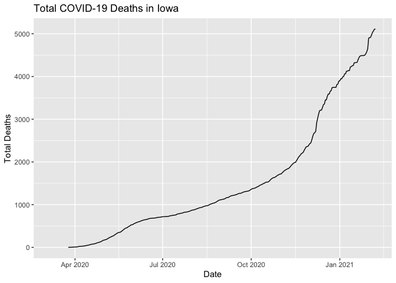<!-- -->

Next try plotting the number of new deaths each day:

``` r
covid_data %>%
  filter(state=="IA") %>%
  ggplot(aes(date, new_deaths)) +
  geom_line() + 
  ggtitle("New Daily Deaths Reported") +
  xlab("Reporting Date") +
  ylab("New Deaths Reported")
```

<!-- -->

Notice that the above plot looks a bit noisy, the data is largely
impacted by day of the week reporting effects. Two ways to see through
the noise are to view the results at a weekly level or to compute a
moving average. For example, you could compute a daily average number of
deaths each reporting week (i.e., sum up all deaths in the week then
divide by 7). Alternatively, you could create a moving average over the
previous 7 days (i.e., for each date add up the previous 7 days and
divide by 7).

Try plotting both the weekly average and then a moving average. Hints:
(1) For the weekly average, you can create a week indicator value using
the `week()` or `epiweek()` functions in the `lubridate` package. Make
sure you also keep track of the year, now that it is 2021, you can also
use the `year()` function for this. (2) To manually compute the moving
average you can use the `lag(x,n)` function in the `dplyr` package to
return the n-period lag of the variable x (e.g., `lag(var,2)` would
return the 2-period lag of the variable `var`), so you could use the lag
function 7 times in the `mutate()` function to create a 7-day moving
average. (3) As an alternative, you can install the `zoo` package and
use the function `rollmean(new_deaths,7, na.pad = T)` to compute a 7 day
moving average inside a mutate statement.

Here is what the weekly average plot should look like:

``` r
covid_data %>%
  filter(state=="IA") %>% 
  group_by(state,year(date),epiweek(date)) %>% 
  mutate(week_avg_deaths=sum(new_deaths)/7) %>% 
  ungroup() %>% 
  ggplot(aes(date, week_avg_deaths)) +
  geom_line() +
  ggtitle("Weekly-Average Number of Daily Deaths Reported") +
  xlab("Reporting Week") +
  ylab("Weekly average")
```

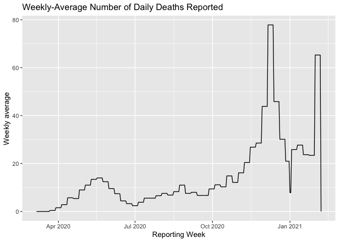<!-- -->

Here is what the moving average plot should look like:

``` r
covid_data %>%
  filter(state=="IA") %>%
  mutate(new_deaths2 = zoo::rollmean(new_deaths,7, na.pad = T)) %>%
  ggplot(aes(date, new_deaths2)) +
  geom_line() +
  ggtitle("Moving Average of Daily Deaths Reported") +
  xlab("Reporting Date") +
  ylab("7-day moving average")
```

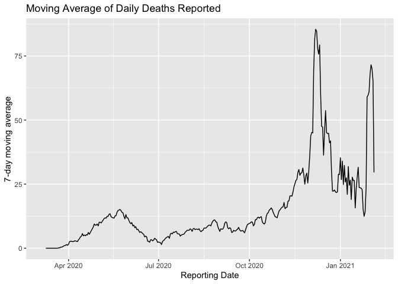<!-- -->

## Positivity rate

Next compute the daily positivity rate (percent of tests that are
positive) each day in the state and then plot a histogram of the daily
positivity rates:

``` r
covid_data %>% 
  filter(state=="IA") %>%
  mutate(new_positivity=100*new_cases/new_tests) %>% 
  ggplot(aes(new_positivity)) +
  geom_histogram()
```

    ## `stat_bin()` using `bins = 30`. Pick better value with `binwidth`.

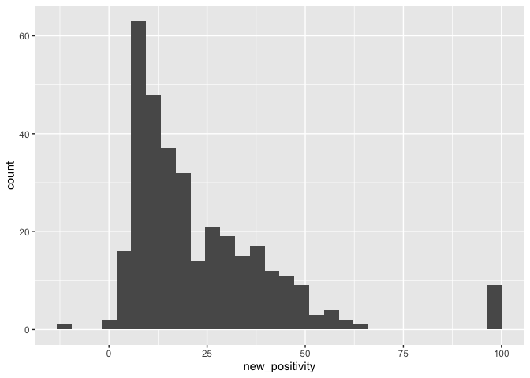<!-- -->

The above plot may be a bit noisy because of unusual reporting dates
(e.g., days with an unusually large/small number of tests or positive
cases). We could instead look at the distribution of weekly positivity
rates (i.e. positivity across an entire week). Plot a histogram weekly
positivity rates:

``` r
covid_data %>% 
  filter(state=="IA") %>%
  group_by(year(date),epiweek(date)) %>% 
  summarise(week_positivity=100*sum(new_cases)/sum(new_tests)) %>% 
  ggplot(aes(week_positivity)) +
  geom_histogram()
```

    ## `summarise()` has grouped output by 'year(date)'. You can override using the `.groups` argument.

    ## `stat_bin()` using `bins = 30`. Pick better value with `binwidth`.

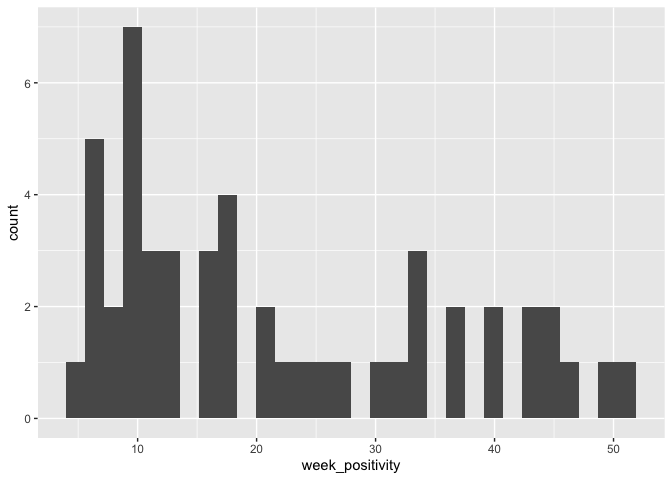<!-- -->

Perhaps a better way to visualize the data is using a box plot
(`geom_boxplot()`):

``` r
covid_data %>% 
  filter(state=="IA") %>%
  group_by(year(date),epiweek(date)) %>% 
  mutate(week_positivity=100*sum(new_cases)/sum(new_tests)) %>% 
  ggplot(aes(week_positivity)) +
  geom_boxplot()
```

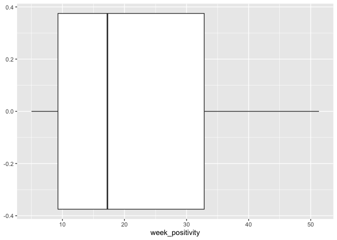<!-- -->

**Challenge problem:** How could you build this graph?

``` r
covid_data %>% 
  filter(state=="IA") %>%
  mutate(`Daily Rates`=100*new_cases/new_tests) %>% 
  group_by(year(date),epiweek(date)) %>% 
  mutate(`Weekly Rates`=100*sum(new_cases)/sum(new_tests)) %>% 
  ungroup() %>% 
  select(`Daily Rates`,`Weekly Rates`) %>% 
  pivot_longer(cols = c(`Daily Rates`,`Weekly Rates`), 
               names_to = "key", values_to = "value") %>% 
  ggplot(aes(x=value,y =key)) +
  geom_violin() +
  xlab("Positivity Rates") +
  ylab("") +
  ggtitle("Distribution of positivity rates in Iowa")
```

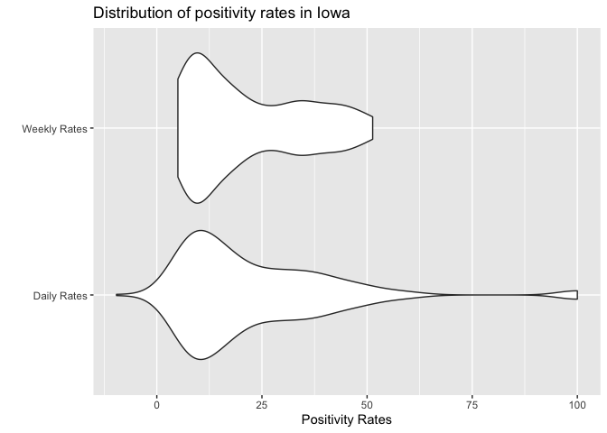<!-- -->

## Cases and Deaths

Now try plotting total cases and deaths across time in the state of
Iowa. Start by trying this with cases in black and deaths in read. Hint:
to do this you can use `geom_line()` twice while specifying the y
aesthetic in each `geom_line()` function (e.g., `geom_line(aes(y = ))` )

``` r
covid_data %>% 
  filter(state=="IA") %>% 
  ggplot(aes(date)) +
  geom_line(aes(y=total_cases)) +
  geom_line(aes(y=total_deaths),color = "red") +
  ylab("Total Cases or Deaths") +
  xlab("Date") +
  ggtitle("Trends in cases and deaths in Iowa")
```

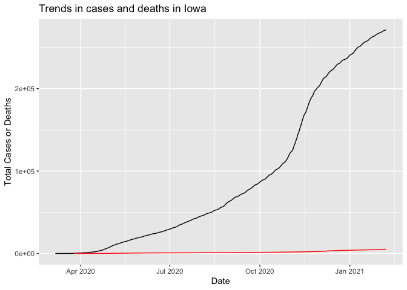<!-- -->

It’s hard to see the trend in deaths so we could center and scale (i.e.,
subtract mean and divide by SD) the two lines so they are on the same
scale. Hint: you can use one `mutate_at()` function to center and scale
the data for these two values, and the `scale()` function can be used to
do the scaling.

``` r
covid_data %>% 
  filter(state=="IA") %>% 
  mutate_at(vars(c(total_cases,total_deaths)),~scale(.)) %>% 
  ggplot(aes(date)) +
  geom_line(aes(y=total_cases)) +
  geom_line(aes(y=total_deaths),color = "red") +
  ylab("Normalized Value in Total Cases or Deaths") +
  xlab("Date") +
  ggtitle("Trends in cases and deaths in Iowa")
```

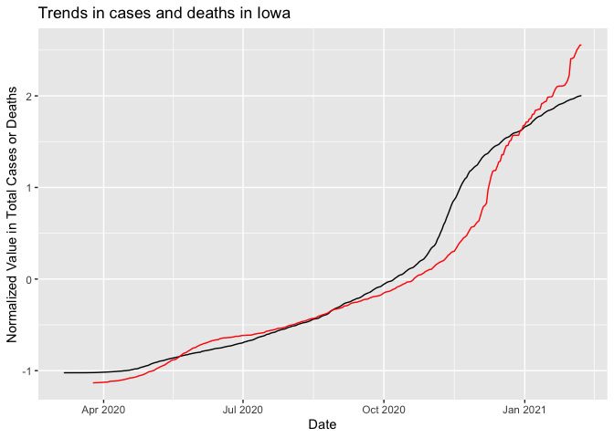<!-- -->

As an alternative you could reshape the data so that you have one column
that gives you the key for the different values (i.e.. total cases or
total deaths) and then a column with the corresponding values. Then you
could use something like facets to compare the two different values in
separate plots.

Your reshaped data should look like this:

``` r
plot_data <- covid_data %>% 
  filter(state=="IA") %>%
  select(date, total_cases,total_deaths) %>% 
  pivot_longer(cols = c(total_cases,total_deaths),names_to = "key", values_to = "value") %>% 
  mutate(key = ifelse(key == "total_cases","Total Cases", "Total Deaths"))
plot_data
```

    ## # A tibble: 678 x 3
    ##    date       key           value
    ##    <date>     <chr>         <dbl>
    ##  1 2021-02-07 Total Cases  271381
    ##  2 2021-02-07 Total Deaths   5108
    ##  3 2021-02-06 Total Cases  270935
    ##  4 2021-02-06 Total Deaths   5108
    ##  5 2021-02-05 Total Cases  270633
    ##  6 2021-02-05 Total Deaths   5067
    ##  7 2021-02-04 Total Cases  269984
    ##  8 2021-02-04 Total Deaths   5033
    ##  9 2021-02-03 Total Cases  269284
    ## 10 2021-02-03 Total Deaths   4975
    ## # … with 668 more rows

``` r
plot_data %>% 
  ggplot(aes(date,value)) +
  geom_line() +
  facet_wrap(~key,scales = "free_y") +
  ylab("Total Cases or Deaths") +
  xlab("Date") +
  ggtitle("Trends in cases and deaths in Iowa")
```

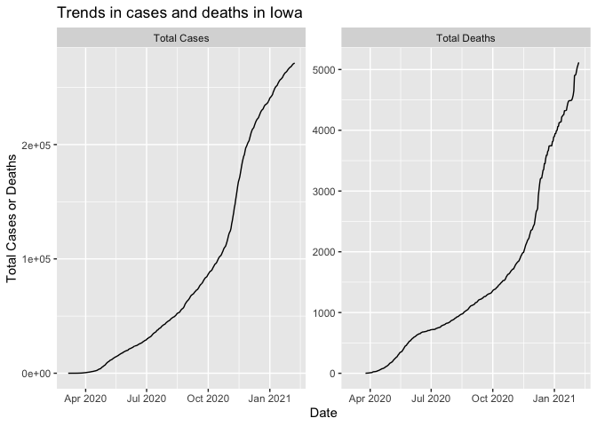<!-- -->

# Plotting Trends Across States

## Iowa and its neighbors

Now let’s compare COVID data in Iowa to neighboring states.

Let’s start by repeating the box plot created above to show the
distribution of weekly positivity rates across states. Specifically, use
multiple box plots that are distinguished by color (note: here we use
both the x and y arguments of the boxplot function).

``` r
covid_data %>%
  filter(state %in% c("IA","NE","SD","WI","MN","IL","MO")) %>% 
  group_by(state,year(date),epiweek(date)) %>% 
  mutate(week_positivity=100*sum(new_cases)/sum(new_tests)) %>% 
  ggplot(aes(week_positivity,state, fill = state)) +
  geom_boxplot() +
  ylab("State") +
  xlab("Weekly Positivity") +
  ggtitle("Weekly Positivity Rates Across States")
```

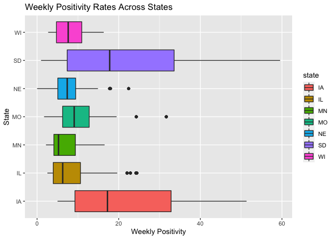<!-- -->

Next return to daily death count line plot from above, and compare
across states using colors to distinguish states:

``` r
covid_data %>%
  filter(state %in% c("IA","NE","SD","WI","MN","IL","MO")) %>% 
  ggplot(aes(date,new_deaths,color = state)) +
  geom_line() +
  ylab("New Daily Deaths") +
  xlab("Date") +
  ggtitle("New daily deaths reported in IA and neighboring states")
```

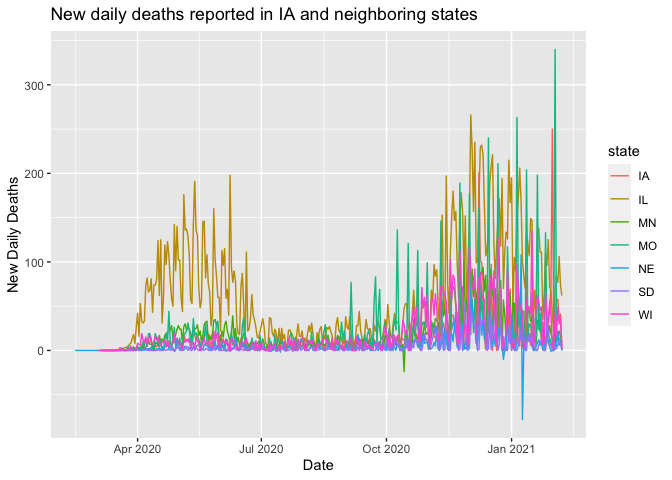<!-- -->

That was ugly! It’s a bit challenging to see a difference in the trends
across states because they are overlapping. An alternative approach is
to plot a grid of individual plots for each state:

``` r
covid_data %>%
  filter(state %in% c("IA","NE","SD","WI","MN","IL","MO")) %>% 
  ggplot(aes(date,new_deaths)) +
  geom_line() +
  facet_wrap(~state, scales = "free_y")+
  ylab("New Daily Deaths") +
  xlab("Date") +
  ggtitle("New daily deaths reported in IA and neighboring states")
```

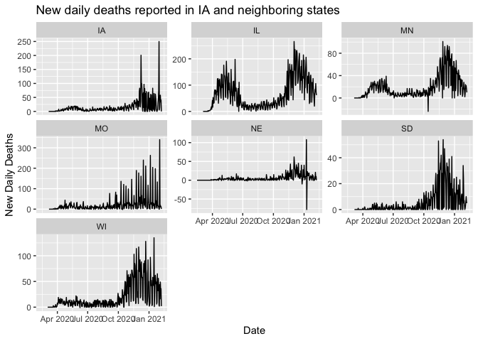<!-- -->

Notice that NE and MN still have some weirdness going on (i.e., negative
deaths). Clean up the plot by removing those values:

``` r
covid_data %>%
  filter(state %in% c("IA","NE","SD","WI","MN","IL","MO")) %>% 
  filter(new_deaths>=0) %>% 
  ggplot(aes(date,new_deaths)) +
  geom_line() +
  facet_wrap(~state, scales = "free_y") +
  ylab("New Daily Deaths") +
  xlab("Date") +
  ggtitle("New daily deaths reported in IA and neighboring states")
```

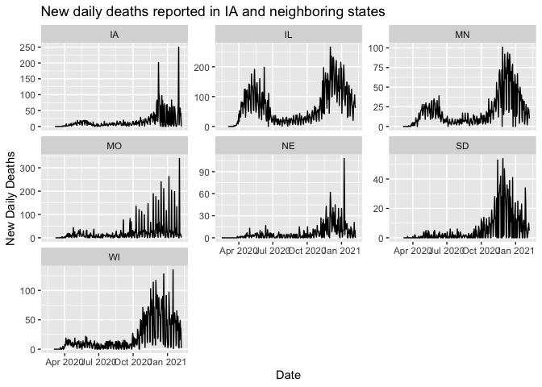<!-- -->

## Analyze relationship with state population and cases/mortality

Next, create a scatter plot for all 50 states comparing the state
population to the total number of casese. Then add a linear trend line
using `geom_smooth(method = lm)` , to depicted the “expected”
relationship between

``` r
covid_data %>% 
  filter(date==max(date)) %>% 
  ggplot(aes(x = population, y = total_cases)) +
  geom_point() +
  geom_smooth(method = lm) +
  ylab("Total Cases") +
  xlab("State Population") +
  ggtitle("Trends in population and total cases across all states")
```

    ## `geom_smooth()` using formula 'y ~ x'

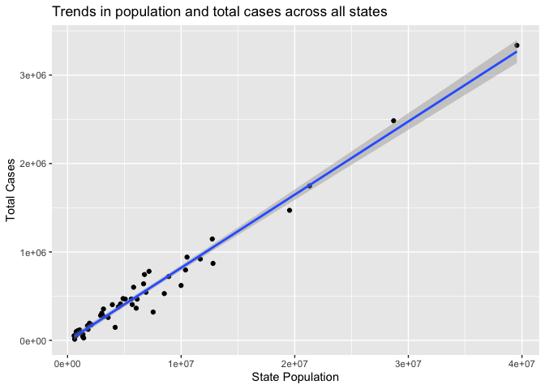<!-- -->

Now do the same thing with mortality:

``` r
covid_data %>% 
  filter(date==max(date)) %>% 
  ggplot(aes(x = population, y = total_deaths)) +
  geom_point() +
  geom_smooth(method = lm) +
  ylab("Total Deaths") +
  xlab("State Population") +
  ylab("Total Deaths") +
  xlab("State Population") +
  ggtitle("Trends in population and total deaths across all states")
```

    ## `geom_smooth()` using formula 'y ~ x'

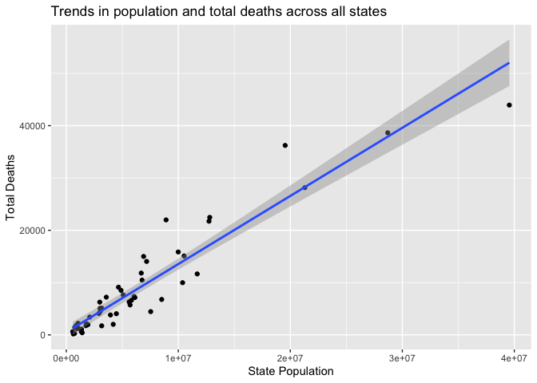<!-- -->

Next try using a reshaping function to reshape the data and plot both
the trends with mortality and number of cases

``` r
covid_data %>%
  filter(date==max(date)) %>% 
  select(date,state,population,total_cases,total_deaths) %>% 
  pivot_longer(cols = c(total_cases,total_deaths), names_to = "key", values_to = "value") %>% 
  mutate(key = ifelse(key=="total_cases","Total Cases", "Total Deaths")) %>% 
  ggplot(aes(x = population, y = value)) +
  geom_point() +
  geom_smooth(method = lm) +
  facet_wrap(~key,scales = "free_y") +
  ylab("Total Cases/Deaths") +
  xlab("State Population") +
  ggtitle("Trends in population and total cases/deaths across all states")
```

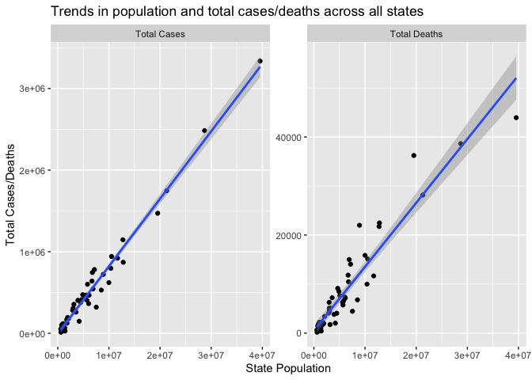<!-- -->

**Advanced question (optional):** Can you identify which states have a
total number of deaths that fall above or below their expected value
based on population? In other words, which states have deaths that fall
above the trend line in the plots above. Here is what the resulting
values would look like:

``` r
# fit model
model_data <- covid_data %>% 
  filter(date==max(date))

# fit model
fit <- lm(total_deaths ~ population, data = model_data)

model_data %>% 
  mutate(predicted_deaths=predict(fit)) %>% 
  filter(total_deaths>predicted_deaths) %>% 
  select(state,total_deaths,predicted_deaths) %>% 
  mutate(excess_deaths=total_deaths-predicted_deaths)
```

    ## # A tibble: 22 x 4
    ##    state total_deaths predicted_deaths excess_deaths
    ##    <chr>        <dbl>            <dbl>         <dbl>
    ##  1 AL            8515            6885.         1630.
    ##  2 AR            5076            4445.          631.
    ##  3 AZ           14048            9859.         4189.
    ##  4 CT            7214            5172.         2042.
    ##  5 GA           15092           14219.          873.
    ##  6 IA            5108            4630.          478.
    ##  7 IL           21738           17113.         4625.
    ##  8 IN           11817            9235.         2582.
    ##  9 LA            9119            6588.         2531.
    ## 10 MA           14999            9508.         5491.
    ## # … with 12 more rows

### How has the pandemic played out in the Midwest compared to other locations in the US across time?

Create a series of plot that describe how the pandemic has played out in
the midwest compared to the rest of the US. Specifically compare Iowa
and it’s neighbors to the rest of the 50 states. To do so create a plot
with lines plotting the cumulative number of cases across times for all
50 states. Then make the lines for Iowa and its neighbors colored and
thick, while keeping the lines for all other states thin and grey.
*Sidenote: These types of plots are often used to depict different
simulation trials*

Hint: Here is an example of a way to create a dataset that can then be
used to generate this plot:

``` r
plot_data <- covid_data %>% 
  mutate(total_cases_pc = total_cases/population)  %>% 
  select(state,date,total_cases_pc) %>% 
  mutate(state2 = ifelse (state %in% c("IA","NE","SD","WI","MN","IL","MO"), 
                          state, NA),
         total_cases_pc2 = ifelse (state %in% c("IA","NE","SD","WI","MN","IL","MO"),
                                   total_cases_pc, NA)) 
```

Here is what your final plot should look like:

``` r
plot_data %>% 
  ggplot(aes(date,total_cases_pc, group = state)) +
  geom_line(color = "grey", size = 0.3, alpha = 0.7) +
  geom_line(aes(x = date, y=total_cases_pc2, color = state2),size = 1.2) +
  theme_bw() +
  ylab("Total Cases Per Capita") +
  xlab("Reporting Date") +
  theme(legend.title = element_blank()) +
  scale_color_discrete(na.translate=FALSE) +
  ggtitle("Total Cases in Iowa and Neighboring States",
          subtitle = "Other US states depicted in grey")
```

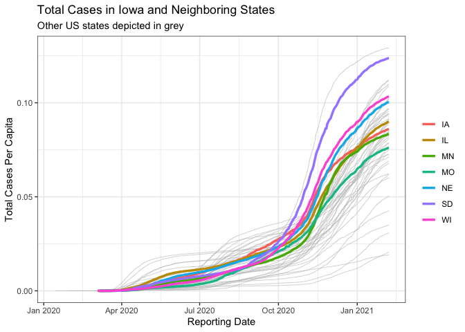<!-- -->

Next, create a similar plot to compare Iowa to a handful of other states
across the US. Specifically compare Iowa to AZ, NJ, MA, ND, VT, CO and
FL. Your plot should then look like the following:

``` r
plot_data <- covid_data %>% 
  mutate(total_cases_pc = total_cases/population)  %>% 
  select(state,date,total_cases_pc) %>% 
  mutate(state2 = ifelse (state %in% c("IA","AZ","NJ","MA","ND","VT","CO","FL"), state, NA)) %>% 
  mutate(total_cases_pc2 = ifelse (state %in% c("IA","AZ","NJ","MA","ND","VT","CO","FL"), total_cases_pc, NA)) 

plot_data %>% 
  ggplot(aes(date,total_cases_pc, group = state)) +
  geom_line(color = "grey", size = 0.3, alpha = 0.7) +
  geom_line(aes(x = date, y=total_cases_pc2, color = state2),size = 1) +
  theme_bw() +
  ylab("Total Cases Per Capita") +
  xlab("Reporting Date") +
  theme(legend.title = element_blank()) +
  scale_color_discrete(na.translate=FALSE) +
  ggtitle("Total Cases in Iowa and non-Neighboring States",
          subtitle = "Other US states depicted in grey")
```

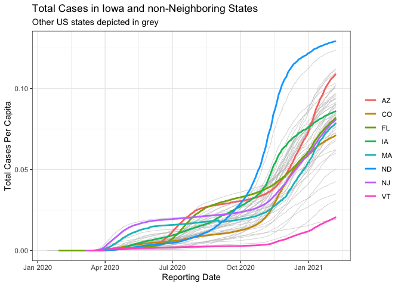<!-- -->

**Challenge problem:** Create plots depicting the trajectory of the
pandemic across multiple states, like the above plots, but now use
facets to create a side-by-side plot of both the number of total cases
and total deaths.

Your plots should look like the following for Iowa and neighboring
states. (Hint: use `select()` along with a reshaping command before you
compute the number of total cases per capita; this will create a column
indicator to denote deaths per capita and cases per-capita).

``` r
plot_data <- covid_data %>% 
  select(date,state,total_cases,total_deaths,population) %>% 
  pivot_longer(cols = c(total_cases,total_deaths), names_to = "key", values_to = "value") %>% 
  mutate(total_cases_pc = value/population)  %>% 
  mutate(state2 = ifelse (state %in% c("IA","NE","SD","WI","MN","IL","MO"), state, NA),
         total_cases_pc2 = ifelse (state %in% c("IA","NE","SD","WI","MN","IL","MO"), total_cases_pc, NA)) %>% 
  mutate(key = ifelse(key=="total_cases","Total Cases", "Total Deaths"))

plot_data %>% 
  ggplot(aes(date,total_cases_pc, group = state)) +
  geom_line(color = "grey", size = 0.3, alpha = 0.7) +
  geom_line(aes(x = date, y=total_cases_pc2, color = state2),size = 1.2) +
  theme_bw() +
  ylab("Totals Per Capita") +
  xlab("Reporting Date") +
  facet_wrap(~key, scales = "free_y") +
  theme(legend.position = "bottom",
        legend.title = element_blank()) +
  scale_color_discrete(na.translate=FALSE) +
    ggtitle("Total Cases/Deahts in Iowa and Neighboring States",
          subtitle = "Other US states depicted in grey")
```

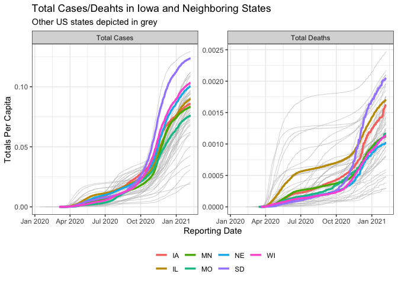<!-- -->

And your plots for Iowa and the other non-neighboring states should look
like:

``` r
plot_data <- covid_data %>% 
  select(date,state,total_cases,total_deaths,population) %>% 
  pivot_longer(cols = c(total_cases,total_deaths), names_to = "key", values_to = "value") %>% 
  mutate(total_cases_pc = value/population)  %>% 
  mutate(state2 = ifelse (state %in% c("IA","AZ","NJ","MA","ND","VT","CO","FL"), state, NA),
         total_cases_pc2 = ifelse (state %in% c("IA","AZ","NJ","MA","ND","VT","CO","FL"), total_cases_pc, NA)) %>% 
  mutate(key = ifelse(key=="total_cases","Total Cases", "Total Deaths"))

plot_data %>% 
  ggplot(aes(date,total_cases_pc, group = state)) +
  geom_line(color = "grey", size = 0.3, alpha = 0.7) +
  geom_line(aes(x = date, y=total_cases_pc2, color = state2),size = 1.2) +
  theme_bw() +
  ylab("Totals Per Capita") +
  xlab("Reporting Date") +
  facet_wrap(~key, scales = "free_y") +
  theme(legend.position = "bottom",
        legend.title = element_blank()) +
  scale_color_discrete(na.translate=FALSE) +
      ggtitle("Total Cases/Deahts in Iowa and non-Neighboring States",
          subtitle = "Other US states depicted in grey")
```

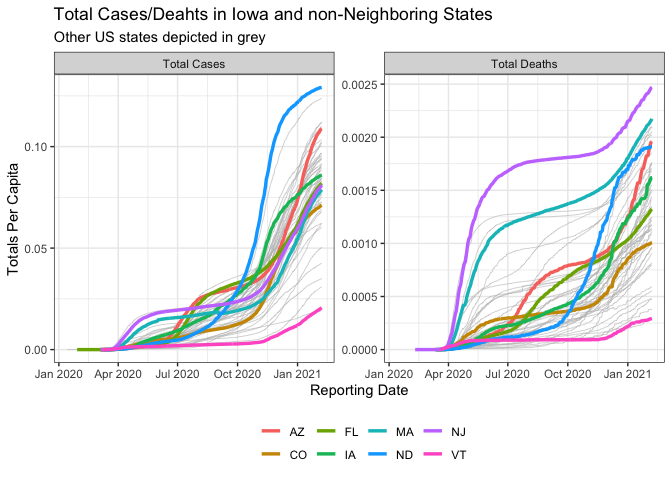<!-- -->
