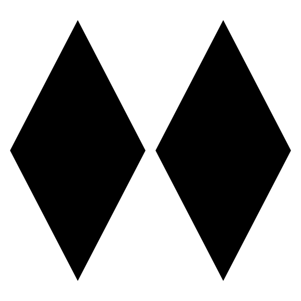

Week 5 Assignment - Tic-Tac-Toe
================
Due 2/

For this assignment you will be building a simulator to play
tic-tac-toe…


Ok…so why in the world are we starting with something completely
unrelated to Epidemiology? First, this is a good programming exercise
for introducing how to think about building a simulation. Second, this
is an easy example to start with, because just about everyone is
familiar with the game and how it is played. Developing a simulation
requires careful consideration of the mechanisms/rules involved. Third,
writing the series of functions to simulate the game of tick-tack-toe is
not all that different from setting up an agent based simulation.
Consider the following steps that must be completed to make this
simulation work, and how they might relate to steps in and agent-based
simulation of disease transmission in a healthcare setting (e.g.,
hospital):

-   Decide how to track and store game play across time - this is
    similar to thinking about how to track agents/patients and infection
    status across time in a healthcare setting

-   Determine which moves are feasible and deciding on a move to make -
    this is similar to deciding how agents interact with one another,
    determining if transmissions occur and updating what states are in

-   Evaluating if and who one the game - this is similar to evaluating
    the overall state of the healthcare setting, if patients need to be
    discharged or admitted,

Building an agent-based-simulation of disease transmission in a
healthcare setting is obviously far more complex and there are many more
steps involved than in the simple tic-tac-toe problem. However, the
three basic steps above of (1) conceptualizing how to store the state of
the simulation across time, (2) creating the interactions and evaluating
effects at each stage, and (3) evaluating how the simulation should
proceed to the next step are present in both problems. So the
tic-tac-toe simulation is a good place to start thinking about how to
craft a simulation using R.

Sidenote: When we get to predictive modeling/machine learning we will
come back to this problem and learn how to create a simple AI to play
against that will learn how best to play the game.

If you need a refresher on the rules of tic-tac-toe see
[here](https://en.wikipedia.org/wiki/Tic-tac-toe).

# Build the game and rules

### Conceptualize the game board

The tic-tac-toe board contains 9 different spaces. As you play the game
you will need to keep track of which spaces are assigned X’s and which
are assigned O’s. Or, alternatively, which positions belong to player 1
and which to player 2. I recommend using a vector to store these values,
but you are free to choose your own approach. The following function
should initialize the game by creating an empty game board. Note: in the
case of tic-tac-toe it is not really necessary to write this as a
function…but we are trying to relate this to future simulations we will
run, so this is good practice.

``` r
initialize_game <- function(){
  
}
```

### Rules - Check available moves

Tic-tac-toe does not have a lot of rules….but you can only play in
spaces that have not been previously taken. Thus, at each stage of the
game, you will need to determine which spaces are available. Write a
function that returns the index corresponding to which spaces are
currently available. Specifically, this function should take as an
argument a game board and return the available spaces. This will be used
by the next function when we want to make a move.

``` r
available_moves <- function(board){
  
}
```

### Make a move - Make a random move

Next write a function to draw a random move, from those that are
currently available. This function can be written in a couple of ways.
First, it could take, as arguments, the current board and a player whose
turn it is, and then draw a random move. In this case, your function
should then check the available moves (using the function above), choose
one at random, and then edit the board to reflect the move, then return
as an output the resulting board. Alternatively, you could write your
function to take as an argument the available moves identified by the
previous function and simply choose one of them. However, I would
recommend you choose the first approach.

Note: It is not very realistic that a player would simply choose
randomly….a player should be strategic and try to win. We are going to
come back to this point later and develop a new function that is a bit
more strategic.

``` r
random_move <- function(){
  
}
```

### Check win status

Finally, at each state of the game we need to check if any player has
currently won before proceeding. If we find that a given player has 3 in
a row, we should terminate the game and award a winner.

Write a function that takes a board at a given point in the game and
then returns if a player has won or not by checking for 3 and a row.
Remember to check to 3-in-a-row combinations both vertically,
horizontally and in the diagonals.

``` r
check_win <- function(){
  
}
```

# Implement the game

Now you have all the functions necessary to play the game. Take the
functions you created above and piece them together into a complete
game. You will need to use some sort of loop or iteration to play the
game. You will be looping over 9 rounds or less, but might need to
terminate early. (Think why?) Note: you can use the `break` statement to
terminate the loop early.

To get you started, here is an overview of how you might want to call
the functions inside of the loop. Note: depending on which approach you
used to write the `random_move()` function, this loop might look
slightly different.

``` r
# start the game
board <- initialize_game() 

# loop over rounds
for (i in 1:9){
  
  # determine which player's turn it is
  
  # Optional: find available moves if using the second approach described above, if
  # using the first approach this will be impeded in the random_moves() function
  # available_moves()
  
  # make a random move based on what is available (note: if you use the first approach
  # outlined above this function should take a board game, find the available moves, then
  # return the board
  random_move()
  
  # Optional: If you choose the second approach outlined, you will need to update the 
  # the board game after you pick a random move.
  
  # check if anyon has won...if so you will need to exit the loop
  check_win()
  
  # if someone won use the break command to stop the loop
  
}
```

Next turn your game into a function that you can run for multiple
different trials. This function should return some sort of output…what
should it look like? Run the game and watch what you get with the output
you decide on.

``` r
run_game <- function(){
  
}
```

#  Make the computer more realistic

If you got this far, Congratulations! Now consider making the game a bit
more realistic. So far we have been generating random moves…but this is
kind of silly? We should realistically assume that even the best of
players will adhere to two basic strategies:

1.  Don’t get beat - if your opponent has a way to win (i.e., they have
    two in a row with an open space in the third element) the should
    “block” that space.
2.  Play to win - if you have a space available to win you should take
    it.

Figure out how to implement the above strategies. Hint: you will need to
update or modify the `check_win()` function from above. Note also, that
both strategies can be implemented as one step.

#  Make a user interface

Now that you’ve watched the computer play against itself a few times,
consider making the game interactive so that you can play against the
computer. At alternating stages in the game, you would like the game to
ask a user for input on which move to make. You should input your move
and the computer will then choose the next move at random. Start by
always playing as player 1. Then consider updating the function so that
you can choose which order to play in (e.g., you can choose to play
first or second).

In order to make the game interactive, you will need to use the
`readline()` function. Consider the following example as a demonstration
for how this function will work.

``` r
divisible_by_5 <- function(x) x%%5 == 0

count_no_5s <- function(){
  for (i in 1:100){
  
  if (divisible_by_5(i)){
    keep_counting <- readline(prompt=paste0("Encountered multiple of 5:, ",i,
                                            ". Keep counting? Enter Y or N: "))
    if (keep_counting=="N") {
      break
    }
  }
  print(i)
}
}
```

# 

#  Print a Game Board

If you really want to challenge your self consider making the game even
more interactive by printing the board at each stage of the game for the
user to see. Consider writing a function `print_board()` that prints the
current status of the board and integrating it into your interactive
game. For example your function might behave like the following:

``` r
print_board(board)
```

    ## X | O |   
    ##   | X |   
    ##   |   | O

# Bringing it back to Epi

As noted above, the main steps involved in a basic infectious disease
simulator are not that different from the tic-tac-toe simulator we just
built. Here is a rough outline of an infectious disease simulator we
might build. If you feel really ambitious…go ahead and try piecing this
together.

First we build our data to store patients and their state…here things
are a bit more complex so we probably need to use a list:

``` r
build_patients <- function(){
}
```

Next we need to interact our patients to see who might come in contact
with one another. This tells us where potential transmissions might
arise. This is not unlike checking the tic-tac-toe board to see where we
might make our next move:

``` r
make_interactions <- function(){ 
}
```

Next we need to determine which of our interactions resulted in a
potential transmission. We will use random number generation to
determine which infections take place.

``` r
draw_transmissions <- function(){
  
}
```

Now we need to update the patient states. Some of the susceptible
patients who came in contact with infectious agents will move from
susceptible to exposed or infected. Some of the infected cases may
recover or die. We need to determine which states agents are in. This is
obviously much more complicated…but this is similar to checking is
someone has won the tic-tac-toe game

``` r
update_states <- function(){
  
}
```

Finally we can tie all the pieces together into some sort of iteration

``` r
patients <- build_patients()

for (i in 1:100) {
  
  make_interactions()
  
  draw_transmissions()
  
  update_states()
  
}
```
