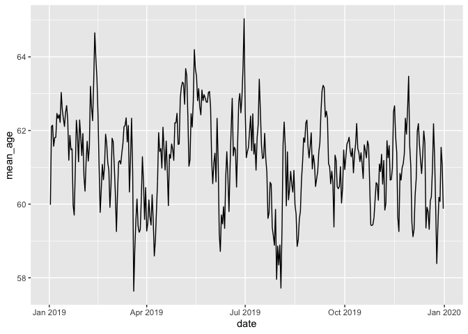
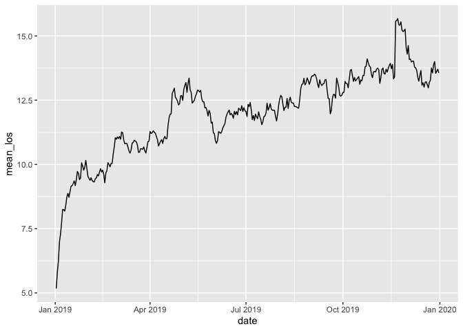

Week6
================
Aaron Miller
3/8/2021

## Due Date: Tuesday 3/16/2021 by 5pm

# Simulate admissions and discharges to a hospital setting

For this assignment you will be building a simulation of admissions and
discharges to a hospital setting. This simulation will randomly draw
patients from the NHDS dataset representing new admissions to a hospital
setting. This type of simulation could be used as part of a larger
simulation model designed to simulate activities within a hospital
setting. For example, this could be used inside an infectious disease
model to simulate transmission of HAIs within a healthcare facility, or
inside a model of healthcare interactions and resource utilization.

### Load in the NHDS dataset and subset the data

Start by loading the NHDS adult dataset that we have been working with
in prior assignments:

``` r
load("R/SimEpi/example_data/nhds_adult.RData")
```

Now create a subset called nhds\_reduced that contains the following
variables
`age, sex, race, care_days, dx_adm, dx01, dx02, dx03, DRG, payor_primary, DRG, adm_type, adm_origin, dc_month, region, n_beds, hospital_ownership.`
Rename `age_years` to `age`. This should look like the following:

``` r
nhds_reduced
```

    ## # A tibble: 129,242 x 16
    ##      age sex   race  care_days dx_adm dx01  dx02  dx03  DRG   payor_primary
    ##    <int> <fct> <fct>     <int> <icd9> <icd> <icd> <icd> <chr> <fct>        
    ##  1    19 fema… white         7 <NA>   64403 64663 64723 778   other govern…
    ##  2    20 fema… black         1 29623  29623 <NA>  <NA>  885   Medicaid     
    ##  3    44 fema… black         1 24200  24200 4019  4280  627   other privat…
    ##  4    80 fema… not_…         3 7804   25060 78609 7804  074   Medicare     
    ##  5    66 male  white         1 78605  99739 4239  5119  206   Medicare     
    ##  6    52 fema… white         8 2989   96509 34839 1985  917   Medicaid     
    ##  7    76 fema… white        19 78079  1539  5070  25000 329   Medicare     
    ##  8    58 fema… white         7 0389   49322 <NA>  <NA>  192   Medicare     
    ##  9    78 fema… asian        15 311-   29633 59651 78830 885   Medicare     
    ## 10    33 fema… white         1 27801  27801 V854  30000 621   HMO or PPO   
    ## # … with 129,232 more rows, and 6 more variables: adm_type <fct>,
    ## #   adm_origin <fct>, dc_month <int>, region <fct>, n_beds <ord>,
    ## #   hospital_ownership <fct>

### Set initial parameter values

We want our simulation model to take a set of initial parameters that
govern how the simulation operates. Specifically, we need to specify the
range of dates for the simulation to run for (defined by the parameters
`start_date` and `end_date`) and the size of the hospital in terms of
the number of patient beds. Later we will consider extensions to these
sets of parameters to make the simulation a bit more realistic. Here are
the parameters (note there is nothing to do with this step, later we
will pass these to our simulation function):

``` r
start_date <- ymd("2019-01-01") # date for the start of the simulation
end_date <- ymd("2019-12-31") # date for the end of the simulation
hospital_size <- 300 # number of beds
```

### Draw an initial set of patients

Write a function that takes an argument `n` that specifies the number of
patients to draw and then returns a random sample of `n` total patients
from the `nhds_reduced` dataset. Draw your sample with replacement. Call
this function `draw_patients()`. Note: the function `sample_n()` from
the dplyr package can be used to randomly draw a sample of size n from a
given dataset.

``` r
draw_patients <- function(n){
  
}
```

Confirm that your function is work and returns a random draw of the
correct size each time.

``` r
draw_patients(500)
```

    ## # A tibble: 500 x 16
    ##      age sex   race  care_days dx_adm dx01  dx02  dx03  DRG   payor_primary
    ##    <int> <fct> <fct>     <int> <icd9> <icd> <icd> <icd> <chr> <fct>        
    ##  1    68 fema… black         1 7840   2252  7840  34590 055   Medicare     
    ##  2    60 fema… white         1 5990   5990  5968  6186  690   Medicare     
    ##  3    72 male  white         4 20300  28800 20300 V4282 809   Medicare     
    ##  4    55 male  white         8 29590  29534 94810 94524 885   Medicare     
    ##  5    70 fema… white         4 82322  8248  70713 29281 493   Medicare     
    ##  6    66 male  white        19 4280   42823 32723 2766  293   Medicare     
    ##  7    76 male  white        15 <NA>   5718  45620 2867  441   Medicare     
    ##  8    27 fema… other         2 <NA>   V270  66311 66411 775   blue cross b…
    ##  9    88 male  white        11 78791  1537  41071 486-  374   Medicare     
    ## 10    50 fema… black         1 57400  57400 57410 4019  419   HMO or PPO   
    ## # … with 490 more rows, and 6 more variables: adm_type <fct>, adm_origin <fct>,
    ## #   dc_month <int>, region <fct>, n_beds <ord>, hospital_ownership <fct>

Below you will use this function to draw the initial set of patients in
the hospital and to draw new patients each time other patients are
discharged and new patients are admitted. For example, if we wanted to
create the initial set of patients in the hospital we could just draw
all the patients we need based on the hospital size, defined above.
Note: we will recycle this step inside the hospital simulation function
below.

``` r
init_hospital <- draw_patients(hospital_size)

# view output
init_hospital
```

    ## # A tibble: 300 x 16
    ##      age sex   race  care_days dx_adm dx01  dx02  dx03  DRG   payor_primary
    ##    <int> <fct> <fct>     <int> <icd9> <icd> <icd> <icd> <chr> <fct>        
    ##  1    85 male  white         1 60001  60001 42822 78820 713   Medicare     
    ##  2    77 male  not_…         1 <NA>   42823 5849  2764  291   Medicare     
    ##  3    88 male  white         3 2859   53140 2851  5303  378   Medicare     
    ##  4    42 fema… white         7 78079  43311 40300 25062 038   Medicaid     
    ##  5    67 fema… white         2 486-   5070  7863  4019  178   Medicare     
    ##  6    90 fema… white         2 5990   5990  00863 2867  690   Medicare     
    ##  7    70 male  black         1 78650  4254  78650 7851  316   Medicare     
    ##  8    70 male  asian         6 41071  41071 41412 78551 237   Medicare     
    ##  9    80 fema… white         4 1728   27651 261-  1977  640   Medicare     
    ## 10    58 fema… white         1 226-   226-  2452  V142  627   blue cross b…
    ## # … with 290 more rows, and 6 more variables: adm_type <fct>, adm_origin <fct>,
    ## #   dc_month <int>, region <fct>, n_beds <ord>, hospital_ownership <fct>

Now try adding admission and discharge dates to the initial hospital you
drew, call these variable `admdate` and `disdate`. Start by using the
start date of the simulation as the initial admission date (later you
will correct this since this will initially populate a hospital with
patients all having the same admission date). How will you determine the
discharge date (Hint: the information needed is in the dataset). Note:
you will recycle this step later in the hospital simulation, you will
also need to add admission and discharge dates each time you draw new
patients.

Your updated dataset should then look like the following:

``` r
init_hospital
```

    ## # A tibble: 300 x 18
    ##      age sex   race  care_days dx_adm dx01  dx02  dx03  DRG   payor_primary
    ##    <int> <fct> <fct>     <int> <icd9> <icd> <icd> <icd> <chr> <fct>        
    ##  1    73 male  other         3 78900  57420 42731 V5861 446   Medicare     
    ##  2    23 male  black         3 6111   6111  <NA>  <NA>  585   other privat…
    ##  3    62 male  black        22 7245   72271 5849  4254  453   HMO or PPO   
    ##  4    86 fema… white         1 <NA>   V5332 42822 5990  227   Medicare     
    ##  5    30 fema… other         2 V221   V270  65421 64901 766   Medicaid     
    ##  6    46 fema… black         2 <NA>   6262  2189  4019  761   HMO or PPO   
    ##  7    76 male  white        13 35981  V5789 35981 496-  945   Medicare     
    ##  8    22 fema… not_…         3 64663  64663 59010 <NA>  781   not stated   
    ##  9    59 fema… white         2 <NA>   2449  5849  5990  643   Medicaid     
    ## 10    74 fema… not_…         2 <NA>   57400 2761  5601  418   HMO or PPO   
    ## # … with 290 more rows, and 8 more variables: adm_type <fct>, adm_origin <fct>,
    ## #   dc_month <int>, region <fct>, n_beds <ord>, hospital_ownership <fct>,
    ## #   admdate <date>, disdate <date>

### Discharge and Admit Patients

Write a function called `discharge_admit_patients()` that takes two
arguments: a hospital population of currently admitted patients (i.e., a
subset extracted from the `nhds_reduced` dataset), and the current date.
The function should then perform a number of tasks: (1) find patients
who need to be discharged, based on the current date and the `disdate`
defined for patients in the dataset, (2) draw a new set of patients to
replace these discharges, (3) add `admdate` and `disdate` to the newly
admitted patients, and (4) combine the existing patients who were not
discharged along with the newly admitted patients to provide the update
hospital setting.

This function should return a list containing two elements: (1) the
patients who were discharged from the hospital and (2) the updated
hospital containing the newly admitted patients along with those who
were not discharged. Here is a sketch of the function.

``` r
discharge_admit_patients <- function(hospital,date){
  
  # find patients who are discharged
  
  
  # subset hospital to patients who are not discharged

  
  # compute the number discharged
  
  
  # draw new admissions and add admdate and disdate

  
  # rebuild hospital

  # return updated hospital and discharged patients
  return(list())
  
}
```

Test that your function works by running it on the initial hospital you
built above and then advancing the start date by 1.

``` r
discharge_admit_patients(init_hospital,start_date+1) 
```

    ## $hospital
    ## # A tibble: 300 x 18
    ##      age sex   race  care_days dx_adm dx01  dx02  dx03  DRG   payor_primary
    ##    <int> <fct> <fct>     <int> <icd9> <icd> <icd> <icd> <chr> <fct>        
    ##  1    73 male  other         3 78900  57420 42731 V5861 446   Medicare     
    ##  2    23 male  black         3 6111   6111  <NA>  <NA>  585   other privat…
    ##  3    62 male  black        22 7245   72271 5849  4254  453   HMO or PPO   
    ##  4    30 fema… other         2 V221   V270  65421 64901 766   Medicaid     
    ##  5    46 fema… black         2 <NA>   6262  2189  4019  761   HMO or PPO   
    ##  6    76 male  white        13 35981  V5789 35981 496-  945   Medicare     
    ##  7    22 fema… not_…         3 64663  64663 59010 <NA>  781   not stated   
    ##  8    59 fema… white         2 <NA>   2449  5849  5990  643   Medicaid     
    ##  9    74 fema… not_…         2 <NA>   57400 2761  5601  418   HMO or PPO   
    ## 10    29 fema… white         3 64294  64244 64844 311-  776   HMO or PPO   
    ## # … with 290 more rows, and 8 more variables: adm_type <fct>, adm_origin <fct>,
    ## #   dc_month <int>, region <fct>, n_beds <ord>, hospital_ownership <fct>,
    ## #   admdate <date>, disdate <date>
    ## 
    ## $discharges
    ## # A tibble: 57 x 18
    ##      age sex   race  care_days dx_adm dx01  dx02  dx03  DRG   payor_primary
    ##    <int> <fct> <fct>     <int> <icd9> <icd> <icd> <icd> <chr> <fct>        
    ##  1    86 fema… white         1 <NA>   V5332 42822 5990  227   Medicare     
    ##  2    23 fema… not_…         1 <NA>   V270  66331 65971 775   other privat…
    ##  3    29 fema… white         1 V221   V270  65991 34590 775   other privat…
    ##  4    71 male  other         1 <NA>   1629  51881 486-  180   Medicare     
    ##  5    64 fema… white         1 <NA>   8054  3051  4019  552   Medicare     
    ##  6    18 fema… white         1 65453  65453 64723 09954 781   Medicaid     
    ##  7    64 fema… white         1 78932  1591  5990  5119  841   blue cross b…
    ##  8    31 fema… black         1 <NA>   5128  <NA>  <NA>  165   HMO or PPO   
    ##  9    63 fema… not_…         1 41041  41041 42820 4254  247   Medicare     
    ## 10    51 fema… white         1 78900  57401 2452  2859  419   HMO or PPO   
    ## # … with 47 more rows, and 8 more variables: adm_type <fct>, adm_origin <fct>,
    ## #   dc_month <int>, region <fct>, n_beds <ord>, hospital_ownership <fct>,
    ## #   admdate <date>, disdate <date>

## Run Simulation

Write a function called `sim_hospital()` that simulates a hospital
environment across time using the steps and the functions we just wrote.
This function should perform the following operations:

-   Load an initial set of patients using the `draw_patients()` function
    and create their `admdate` and `disdate`

-   Create place holders to store the patient data for all patients who
    are discharged - note this will allow you to track all patients who
    passed through the simulator

-   Create place holders to store any other metrics you would like to
    collect on the state of the simulation across the different date.
    For now we will compute the **mean age** and **mean LOS** of
    patients on a given date.

-   Perform a loop across all remaining days in the simulation (i.e.,
    `start_date+1` through `end_date`) that does each of the following

    -   Update the state of the hospital by discharging and admitting
        patients on that particular date

    -   Add discharged patients into the placeholder containing all
        prior discharges

    -   Compute mean age and mean LOS of the currently admitted patients
        on a particular day, add this information to the corresponding
        placeholder

Your simulation should then return a list containing three elements: (1)
all discharges that occurred in the simulation, (2) the current state of
the hospital (i.e. patients that are admitted on the final day), and (3)
the computed statistics across each day in the simulation. Here is a
sketch of how this function might look:

``` r
sim_hospital <- function(start_date,end_date,hospital_size){
  
  # Build the inital hospital, including the initial 

  
  # create any placeholders needed for the loop

  
  # Loop over - to run this you will need to determine and create a variable total_days
  # to tally how many days to simulate over
  
  for (i in 1:total_sim_days){
    
    # admit and discharge patients
    
    # update hospital
    
    # store the discharges
    
    # compute statistics for the current state of the hospital
    
  }
  
  # return the following
  # The dataset of all patients that passed through the simulation
  # Statistics across days in the simulation for the state of the hospital
  return(list())
  
}
```

Test your function by running it over the parameters you specified above

``` r
sim_res <- sim_hospital(start_date = start_date,
                        end_date = end_date,
                        hospital_size = hospital_size)
```

## Compute some statistics

Now try running you simulation and visualizing some of the output. For
example you could visualize the average age of all patients that were in
the hospital on a particular day:

<!-- -->

Or you could visualize the average los for the patients that were in the
hospital on a given day. Note: your graph will look different than mine
(because this is stochastic), but think about why we are getting this
major shift upward:

<!-- -->

## Extra Considerations - Try these if you have time

The following are extensions to this basic simulation. If you have time,
I would recommend giving these a try. Each of these will allow us to
make the simulation a bit more realistic.

### Specify the type of hospital setting

There are different types of hospitals represented in the dataset (e.g.,
hospital region, number of beds and ownership). You may want to add
parameters to draw patients only from those hospitals that are similar
to the type of hospital you are trying to simulate. For example, maybe
you want to draw admissions from the same type of region, or from
hospitals with the same type of ownership.

``` r
nhds_adult %>% count(region,n_beds,hospital_ownership)
```

    ## # A tibble: 39 x 4
    ##    region    n_beds  hospital_ownership     n
    ##    <fct>     <ord>   <fct>              <int>
    ##  1 northeast 6-99    proprietary          264
    ##  2 northeast 6-99    government           111
    ##  3 northeast 6-99    non_profit          4411
    ##  4 northeast 100-199 non_profit          2825
    ##  5 northeast 200-299 government          2266
    ##  6 northeast 200-299 non_profit          3854
    ##  7 northeast 300-499 government           929
    ##  8 northeast 300-499 non_profit          2185
    ##  9 northeast 500+    non_profit          8077
    ## 10 midwest   6-99    government           145
    ## # … with 29 more rows

### Draw patients according to the admission/discharge month

Some types of diseases and admissions are more seasonal than others
(e.g., more/less likely to occur in winter compared to summer). The NHDS
dataset contains a variable for the discharge month. Try drawing
patients for a corresponding admission date based on this information.

### Pick a non-uniform start date

Currently the stimulation populates the hospital with a set of patients
all having the same admission date. Try updating this so that the
admission date is within some small range of the initial start date of
the simulation. For example maybe each patient admitted, their admission
date is randomly drawn between 1 and x, where x is their LOS or
care\_days.

### Hospital over/under capacity

The way we have setup the simulator, the hospital is always at full
capacity and we immediately draw a new patient for each patient that is
discharged. Consider making number number of new arrivals stochastic in
some way. For example, you might draw new patients using a poisson
distribution where the mean is set to the number of patients discharged.
